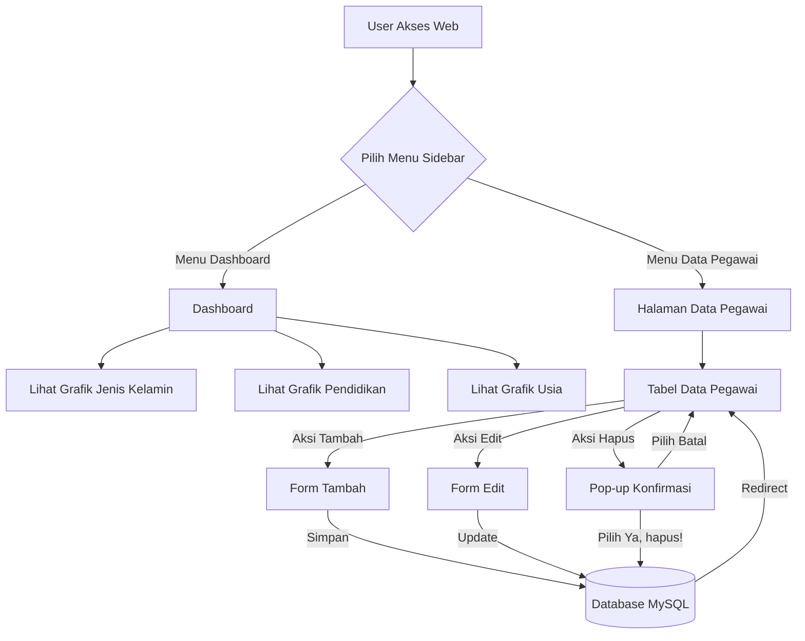

# Sistem Manajemen Data Pegawai - PT YOI CODE

Aplikasi web untuk mengelola data pegawai PT YOI CODE, dibuat menggunakan PHP Native dan MySQL.

## Fitur
- Dashboard (Grafik jenis kelamin, pendidikan, usia)
- CRUD Pegawai (Tambah, Tampil, Edit, Hapus)
- Konfirmasi penghapusan data (SweetAlert2)
- Desain antarmuka Dark Mode

## Alur Aplikasi (Flowchart)


## Tech Stack
- PHP Native
- MySQL
- HTML/CSS/JS
- Chart.js
- SweetAlert2

## Instalasi

1. Copy folder project ini ke dalam direktori server lokal (misal: `C:\laragon\www\` atau `C:\xampp\htdocs\`).
2. Buat database baru di MySQL dengan nama `data_pegawai`.
3. Import file `database.sql` ke dalam database tersebut.
4. Sesuaikan konfigurasi database pada file `config.php` jika diperlukan (default: user `root`, password kosong).
   ```php
   $host = "localhost";
   $user = "root";
   $pass = "";
   $db   = "data_pegawai";
   ```
5. Akses aplikasi melalui browser di:
   `http://localhost/employee-management-system/`

Jika menggunakan terminal (PHP built-in server):
```bash
php -S localhost:8000
```
Lalu akses `http://localhost:8000` di browser.

